# Database Entity Relationship Diagram (ERD) Specification

This document details the database schema for the Carbon Footprint Awareness Platform. It covers entities, relations, cardinality, indexes, constraints, and design considerations.

---

## 1. Mermaid Entity-Relationship Diagram

The ERD below illustrates the core tables and relationships in our PostgreSQL database.

```mermaid
erDiagram
    users {
        uuid id PK
        uuid auth_user_id UK "Supabase UID reference"
        varchar email UK
        varchar full_name
        varchar avatar_url
        timestamp created_at
        timestamp updated_at
    }

    user_preferences {
        uuid id PK
        uuid user_id FK "1:1 relation to users, CASCADE"
        varchar state_code
        varchar diet_type
        varchar transport_preference
        varchar housing_type
        boolean notification_enabled
        timestamp created_at
        timestamp updated_at
    }

    activity_events {
        uuid id PK
        uuid user_id FK "1:N relation to users, CASCADE"
        varchar category "transport, food, electricity, shopping"
        varchar activity_type "car, vegetarian_meal, etc."
        numeric quantity "precision 12, scale 4"
        varchar unit
        jsonb metadata
        timestamp created_at
    }

    emission_factors {
        uuid id PK
        varchar category "transport, food, electricity, shopping"
        varchar activity_type "car_per_km, vegetarian_meal, etc."
        varchar unit
        numeric factor_value "precision 12, scale 6"
        varchar factor_source
        integer version
        timestamp effective_from
        timestamp created_at
    }

    daily_footprints {
        uuid id PK
        uuid user_id FK "1:N relation to users, CASCADE"
        date date
        numeric transport_emissions
        numeric food_emissions
        numeric electricity_emissions
        numeric shopping_emissions
        numeric total_emissions
        timestamp created_at
        timestamp updated_at
    }

    daily_footprint_sources {
        uuid id PK
        uuid daily_footprint_id FK "N:1 relation to daily_footprints, CASCADE"
        uuid activity_id FK "N:1 relation to activity_events, CASCADE"
        uuid emission_factor_id FK "N:1 relation to emission_factors, CASCADE"
        numeric calculated_emission
        timestamp created_at
    }

    mission_templates {
        uuid id PK
        varchar title
        text description
        varchar category "transport, food, electricity, shopping, general"
        varchar difficulty "easy, medium, hard"
        numeric estimated_co2_saving
        integer estimated_time_minutes
        boolean is_active
        timestamp created_at
    }

    user_missions {
        uuid id PK
        uuid user_id FK "N:1 relation to users, CASCADE"
        uuid mission_template_id FK "N:1 relation to mission_templates, CASCADE"
        date assigned_date
        varchar status "assigned, completed"
        timestamp completed_at
        timestamp created_at
    }

    user_streaks {
        uuid id PK
        uuid user_id FK "1:1 relation to users, CASCADE"
        integer current_streak
        integer longest_streak
        date last_activity_date
        integer freeze_count
        timestamp created_at
        timestamp updated_at
    }

    streak_events {
        uuid id PK
        uuid user_id FK "N:1 relation to users, CASCADE"
        varchar event_type "streak_started, streak_extended, streak_broken, freeze_used"
        integer previous_streak
        integer new_streak
        timestamp created_at
    }

    users ||--|| user_preferences : "has"
    users ||--o{ activity_events : "logs"
    users ||--o{ daily_footprints : "accumulates"
    users ||--o{ user_missions : "assigned"
    users ||--|| user_streaks : "has"
    users ||--o{ streak_events : "triggers"
    
    daily_footprints ||--o{ daily_footprint_sources : "composed_of"
    activity_events ||--o{ daily_footprint_sources : "references"
    emission_factors ||--o{ daily_footprint_sources : "applies"
    mission_templates ||--o{ user_missions : "defines"
```

---

## 2. Table Schemas, Constraints, and Indexes

### 2.1 Core User Tables

#### `users`
Represents user profiles. Linked to Supabase Auth.
- **Constraints**:
  - `PRIMARY KEY (id)`
  - `UNIQUE (auth_user_id)` (Index)
  - `UNIQUE (email)` (Index)
- **Indexes**:
  - `ix_users_auth_user_id` (btree)
  - `ix_users_email` (btree)

#### `user_preferences`
Tracks onboarding preferences.
- **Constraints**:
  - `PRIMARY KEY (id)`
  - `FOREIGN KEY (user_id) REFERENCES users(id) ON DELETE CASCADE`
  - `UNIQUE (user_id)` (1:1 relation)

### 2.2 Activity & Carbon Engine Tables

#### `activity_events`
Tracks immutable logged activities.
- **Constraints**:
  - `PRIMARY KEY (id)`
  - `FOREIGN KEY (user_id) REFERENCES users(id) ON DELETE CASCADE`
- **Indexes**:
  - `ix_activity_events_user_id` (btree)
  - `ix_activity_events_category` (btree)
  - `ix_activity_events_activity_type` (btree)

#### `emission_factors`
Tracks versioned scientific constants for calculations.
- **Constraints**:
  - `PRIMARY KEY (id)`
  - `CHECK (factor_value >= 0)`
- **Indexes**:
  - `ix_emission_factors_category` (btree)
  - `ix_emission_factors_activity_type` (btree)

#### `daily_footprints`
Pre-aggregated rollups by category per user/date.
- **Constraints**:
  - `PRIMARY KEY (id)`
  - `FOREIGN KEY (user_id) REFERENCES users(id) ON DELETE CASCADE`
- **Indexes**:
  - `ix_daily_footprints_user_id` (btree)
  - `ix_daily_footprints_date` (btree)
  - Composite `idx_user_date` on `(user_id, date)` for rapid daily lookup

#### `daily_footprint_sources`
Calculation audit log. Maps daily rollups back to specific logs and versioned factors.
- **Constraints**:
  - `PRIMARY KEY (id)`
  - `FOREIGN KEY (daily_footprint_id) REFERENCES daily_footprints(id) ON DELETE CASCADE`
  - `FOREIGN KEY (activity_id) REFERENCES activity_events(id) ON DELETE CASCADE`
  - `FOREIGN KEY (emission_factor_id) REFERENCES emission_factors(id) ON DELETE CASCADE`
- **Indexes**:
  - `ix_daily_footprint_sources_daily_footprint_id` (btree)
  - `ix_daily_footprint_sources_activity_id` (btree)
  - `ix_daily_footprint_sources_emission_factor_id` (btree)

### 2.3 Missions & Streaks Engagement Tables

#### `mission_templates`
Master templates for daily actions.
- **Constraints**:
  - `PRIMARY KEY (id)`
- **Indexes**:
  - `ix_mission_templates_category` (btree)
  - `ix_mission_templates_difficulty` (btree)

#### `user_missions`
Tracks user daily mission templates, status, and completions.
- **Constraints**:
  - `PRIMARY KEY (id)`
  - `FOREIGN KEY (user_id) REFERENCES users(id) ON DELETE CASCADE`
  - `FOREIGN KEY (mission_template_id) REFERENCES mission_templates(id) ON DELETE CASCADE`
- **Indexes**:
  - `ix_user_missions_user_id` (btree)
  - `ix_user_missions_mission_template_id` (btree)
  - `ix_user_missions_assigned_date` (btree)
  - `ix_user_missions_status` (btree)

#### `user_streaks`
Active engagement streak status.
- **Constraints**:
  - `PRIMARY KEY (id)`
  - `FOREIGN KEY (user_id) REFERENCES users(id) ON DELETE CASCADE`
  - `UNIQUE (user_id)` (1:1 relation)
- **Indexes**:
  - `ix_user_streaks_user_id` (btree)
  - `ix_user_streaks_last_activity_date` (btree)

#### `streak_events`
Audit trails of streak starting, extending, breaking, or freezing.
- **Constraints**:
  - `PRIMARY KEY (id)`
  - `FOREIGN KEY (user_id) REFERENCES users(id) ON DELETE CASCADE`
- **Indexes**:
  - `ix_streak_events_user_id` (btree)
  - `ix_streak_events_event_type` (btree)

---

## 3. Cardinality Summary

1. **`users` ↔ `user_preferences`**: **1:1**. Every user profile has exactly one preferences set.
2. **`users` ↔ `activity_events`**: **1:N**. A user can log zero or many activities. Activities are immutable.
3. **`users` ↔ `daily_footprints`**: **1:N**. A user has one summary row per calendar date.
4. **`daily_footprints` ↔ `daily_footprint_sources`**: **1:N**. A daily summary represents the sum of one or more activity events.
5. **`activity_events` ↔ `daily_footprint_sources`**: **1:N** (typically 1:1). Traces exactly how much carbon an activity logged.
6. **`emission_factors` ↔ `daily_footprint_sources`**: **1:N**. Traces which exact conversion factor was used for a calculation.
7. **`mission_templates` ↔ `user_missions`**: **1:N**. A master template can be assigned to many different users over time.
8. **`users` ↔ `user_missions`**: **1:N**. A user receives one mission per calendar date.
9. **`users` ↔ `user_streaks`**: **1:1**. A user has exactly one active streak tracking status record.
10. **`users` ↔ `streak_events`**: **1:N**. A user generates multiple events over their habit-formation lifecycle.

---

## 4. Future Expansion Considerations

### 4.1 AI Memory Layer (pgvector)
When implementing Sprint 6 & 7 (AI & pgvector memory layer), we will add:
- **`ai_insights`**: Stores generated Gemini coaching summaries (1:N with users).
- **`ai_memory_embeddings`**: An embedding vector store table mapping user summaries to an indexed `VECTOR(1536)` (or Gemini's embedding output size) for semantic similarity queries.

### 4.2 Community & Challenges
When implementing Sprint 8 (Groups & Challenges), we will add:
- **`groups`**: Repesents social teams (owner_id references users).
- **`group_members`**: Join table mapping users to groups (N:N relationship) with roles.
- **`challenges`**: Global or group challenges with start and end dates.
- **`challenge_participants`**: Join table mapping users to challenges to track competitive progress.
